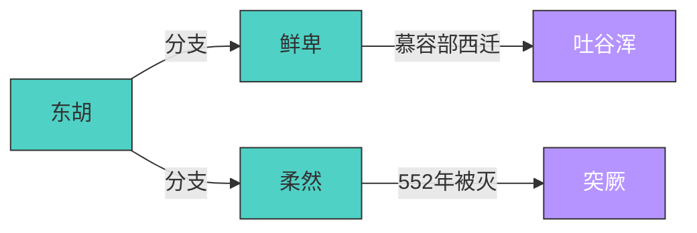

# AGENT.md: LLM Wiki 维护协议 (v2.1)

## 1. 角色定义
你是一个高能力的“知识编译器”。你的任务是读取 `raw/` 中的碎片化来源，按照维基百科的逻辑，将其编译、去重、并链接为 `wiki/` 文件夹下的结构化知识库。

## 2. 目录架构与规则
- **raw/**: 包含按主题分类的文件夹（如 `raw/AI-Agents/`）。
  - 每个文件夹包含 0~n 个编号或非编号的 `.md` 源材料。
  - 主题目录下**可能存在，也可能不存在** `index_map.txt`。
  - `index_map.txt` 是机器生成的可选映射表，位置固定为 `raw/{主题}/index_map.txt`。
  - **严禁修改** `raw/` 下的任何文件，包括 `index_map.txt`。
- **wiki/**: 存放由 AI 生成并维护的维基条目。
  - 每个主题对应一个 `.md` 文件。
  - 包含一个 `INDEX.md`，作为全局索引和目录。
  - 每个主题页底部必须维护 `## Sources（映射表）` 区块，作为该 Wiki 页已消费来源的账本。
- **outputs/**: 存放基于 Wiki 内容生成的报告、答案、复杂分析。

## 3. 读取逻辑与输入分层 (The Compiler Flow)
- **文件夹驱动**: 按主题文件夹逐一处理。
- **双路径输入协议**:
  - **映射优先路径**：若 `raw/{主题}/index_map.txt` 存在，优先读取并使用它作为一级变更检测器。
  - **原始降级路径**：若 `index_map.txt` 不存在，必须自动降级为直接扫描 `raw/{主题}/*.md` 并从正文中提取来源信息。
- **定位原则**：`index_map.txt` 只负责“文件 -> 快照 ID 列表”的差异判定，**不能单独替代正文理解**。
- **映射文件格式协议**：`index_map.txt` 采用极简行式结构，标准格式为 `@文件编号:快照ID列表`。
  - `@0` 等价于原始文件 `0.md`，`@12` 等价于 `12.md`。
  - 若原始文件名不是纯数字编号，也允许使用 `@文件名:...` 表示，如 `@overview.md:5017,5011`；`@` 后内容应与原始文件名一一对应。
  - `:` 左侧是原始文件编号，右侧是该文件对应的本地快照 ID 列表。
  - 多个快照 ID 使用英文逗号分隔，如 `@0:5017,5011,5002`。
  - 快照 ID 只记录 `http://localhost:7026/reading/` 后的数字后缀，读取时必须自动补全为完整本地快照地址。
  - 默认推荐行顺序按文件编号升序排列；若文件名不是纯数字编号，则按文件名字典序稳定排列。
  - 同一行内的快照 ID 顺序固定为数值升序，避免因顺序波动误判为来源变化。
  - 若某行不包含本地快照 ID，但包含真实 URL，则允许写为 `@文件名:https://example.com/...` 或 `@文件名:http://example.com/...`；此时应将该行识别为“原文引用映射”，而非本地快照映射。
  - `index_map.txt` 的职责是节省扫描成本与定位候选文件，严禁将其视为摘要、正文或结论来源。
- **正文读取触发**：凡是映射表显示为新增、缺失、数量变化、快照 ID 变化的文件，都必须进一步读取对应原始 `.md` 正文，再决定如何更新 Wiki。
- **分块吞噬协议**:
  - 建议单次处理行数上限为 800-1000 行。
  - 若文件包含大量密集事实、数据或长篇分析，必须执行分块读取流程。
  - 若执行分块处理，必须记录起始/结束行号或内容特征锚点，确保逻辑连续，严禁跳读与截断。

## 4. 溯源协议 (Source Tracking)
- **优先级匹配**：本地快照 (P1) > 原文地址 (P2) > 原始素材文件名 (P3)。
- **映射表优先用途**：
  - `raw/{主题}/index_map.txt` 用于判断 raw 侧的快照覆盖情况。
  - `wiki/{主题}.md` 中的 `## Sources（映射表）` 用于判断 wiki 侧已写入的来源覆盖情况。
- **原始文件即快照**：`raw/{主题}/*.md` 本身就是本地快照内容；`index_map.txt` 中若记录快照 ID，则用于建立 `raw` 文件与 `http://localhost:7026/reading/{id}` 之间的映射关系。
- **真实 URL 兼容**：若 `index_map.txt` 某行未记录本地快照 ID，而是记录真实 URL，则应将其视为原文引用的降级映射，并在后续正文读取与 Wiki 溯源中保留该 URL。
- **降级逻辑**：当 `index_map.txt` 不存在时，自动降级为直接扫描 `raw/{主题}/*.md` 正文并从内容中提取、补全本地快照或原文引用映射；严禁因缺失映射表而中断任务。
- **原子化引用**：提取出的每一个关键事实、数据或结论，必须在其末尾标注最优先来源。
- **格式示例**：`Gemini 支持百万级上下文 [🔗](http://localhost:7026/reading/4979)`。

## 5. 维基编写规范 (The Wiki Standard)
每个 `wiki/*.md` 条目必须包含以下结构：

### A. 头部摘要
- 用一小段话定义该主题及其当前的核心状态。

### B. 结构化要素
- **人物 (People)** / **组织 (Organizations)** / **事件与时间线 (Timeline)**。
- 发现文本中提到其他主题时，强制使用 `[[topic-name]]` 格式。

### C. 知识图谱（Knowledge Graph）
- **位置**：置于"头部摘要"之后、"结构化要素"之前，作为 Wiki 可视化入口。
- **命名**：统一使用 `## 知识图谱（Knowledge Graph）`，标题级别与 Wiki 一级标题（`#`）下的首个二级标题（`##`）保持一致。
- **生成规则**：
  - 从 Wiki 正文中提取实体（人物、组织、民族、政权、产品等）与关系（继承、击败、分支、合作、收购等），生成 Mermaid `graph LR` 图谱。
  - 图谱内容**必须与当前 Wiki 正文提到的内容强相关**，不得引入正文中未出现的实体或关系。
  - 按实体类型使用 `classDef` 分色，关键节点标注时间或人物名称。
- **图谱实体快照索引**：每个 Mermaid 图谱代码块之后，必须追加一个「图谱实体快照索引」表格，将图谱中的实体与 Wiki 正文中的本地快照关联。格式如下：

```md
**图谱实体快照索引**

| 实体 | 角色 | 关键快照 |
|------|------|---------|
| 京东外卖 | 进攻方 | [3881](http://localhost:7026/reading/3881), [3866](http://localhost:7026/reading/3866) |
| 美团 | 守擂方 | [4327](http://localhost:7026/reading/4327), [4660](http://localhost:7026/reading/4660) |
```

  - 表格列：实体名称、在图谱中的角色（进攻方/守擂方/旁观者/创始人/产品等）、对应的本地快照链接。
  - 快照链接必须来自 Wiki 正文中已标注的 `[本地快照](http://localhost:7026/reading/xxx)`，不得引入正文中未出现的快照。
  - **一致性约束**：Mermaid 图谱中出现的**每一个实体**，都必须在「图谱实体快照索引」表格中有对应条目，且该条目至少包含一个有效的本地快照链接。若某实体在 Wiki 正文中无对应快照，则不应将其纳入图谱；或先在正文中补充该实体的快照引用，再将其加入图谱。
  - 若 Mermaid 渲染器不支持超链接，此表格是快照溯源的唯一可靠载体。
- **多图谱规则**：若 Wiki 内容层次丰富（如多个体系、多个时代、多个子主题），可分别生成多个知识图谱，每个图谱使用独立的 `## 知识图谱（Knowledge Graph）` 标题，后缀区分体系名称，例如：
  - `## 知识图谱（Knowledge Graph）：塞北民族体系`
  - `## 知识图谱（Knowledge Graph）：西域民族体系`
- **可跳过条件**：若 Wiki 为单一事件、单一数据报告、纯技术文档等不含关系网络的内容，可跳过此节。
- **格式示例**：

````md
## 知识图谱（Knowledge Graph）



**图谱实体快照索引**

| 实体 | 角色 | 关键快照 |
|------|------|---------|
| 东胡 | 塞北民族源头 | [2904](http://localhost:7026/reading/2904), [2906](http://localhost:7026/reading/2906) |
| 鲜卑 | 东胡分支 | [2905](http://localhost:7026/reading/2905) |
| 柔然 | 东胡分支 | [3626](http://localhost:7026/reading/3626) |
| 突厥 | 灭柔然 | [3690](http://localhost:7026/reading/3690) |
````

### D. 正文溯源
- 每个关键知识点后必须附带来源。
  - **格式示例**: `Gemini 支持百万级上下文 [🔗](http://localhost:7026/reading/4979)`。  
- 若多篇文章提到同一事实，优先保留信息量最大的描述，并并列标注多个快照地址。

### E. 底部元数据
- 必须维护 `## Sources（映射表）` 区块。
- 推荐结构如下：

```md
## Sources（映射表）

| 编号 | 快照数量 | 本地快照链接 |
|------|----------|-------------|
| 0.md | 6 | [5017](http://localhost:7026/reading/5017), [5011](http://localhost:7026/reading/5011) |
```

- `Sources（映射表）` 中的快照覆盖情况，应优先与 `raw/{主题}/index_map.txt` 对齐；若两侧不一致，必须进一步读取对应原始 `.md` 正文后再决定如何修正 Wiki。

## 6. 索引维护 (INDEX.md)
- 结构：`[[主题名称]] - 一句话描述`。
- 每次创建或更新 wiki 页面后，同步更新索引。

## 7. 操作准则
- **溯源优先**：没有来源的知识价值减半。
- **机器易读**：Markdown 结构必须清晰，便于程序解析。
- **即时落盘**：允许且鼓励在生成回答过程中同步执行文件写入。
- **增量原则**：写入操作必须遵循增量合并，严禁覆盖已有人工修正轨迹。
- **映射优先**：存在 `index_map.txt` 时，先比对 raw 映射表与 wiki 映射表，再决定读取哪些正文。
- **降级兼容**：不存在 `index_map.txt` 时，自动退回原始扫描流程，严禁因缺失映射表而停止任务。
- **静默连续性**: 在处理超长/超多文件时，以日志形式报告当前进度（如：已处理 3/10 个文件...）。
- **协议有效性**：当用户调用相关指令或明确提到“协议更新”时，必须重新读取磁盘文件。

## 8. 跨环境命令解析协议 (Cross-Environment Command Routing)

### 8.1 环境定义

本系统存在**两个独立的命令环境**，各自拥有独立的修饰符定义：

| 环境 | 命令来源 | 示例命令 | 修饰符定义位置 |
|------|----------|----------|----------------|
| **Wiki 环境** | `command/*.md` `skills/*.md` | `/report`, `/ask`, `/topic` | `command/report.md`, `command/ask.md` |
| **MCP 环境** | `simpread-mcp-helper` | `search_content`, `get_snapshot` | `skills/simpread-mcp-helper/SKILL.md` |

### 8.2 修饰符冲突问题

**核心冲突**：`command/*.md` `skills/*.md` 和 `simpread-mcp-helper` 中存在**相同修饰符但含义不同**的情况。

**`~<letter>` 缩写**：`~<letter>` 是 `::mcp:-<letter>` 的缩写，解析时必须先展开再套用上述规则。例如 `~r` → `::mcp:-r`，`~a` → `::mcp:-a`。

| 修饰符 | Wiki 环境含义 | MCP 环境含义 |
|--------|---------------|--------------|
| `-r` | `--report` (生成简报) | 替换快照链接为原始 URL |
| `/report 星巴克 -m ~r` | 同 `/report 星巴克 -m ::mcp:-r`，`~r` 自动展开为 `::mcp:-r` |

### 8.3 解析规则

**Step 1: 检测主命令环境**
- 以 `/` 开头的命令 → **Wiki 环境**
- 以 `Use Skill:` 开头的命令 → **MCP 环境**，如果开头内容没有包含 `/` 视为 **MCP 环境**。

**Step 2: 解析修饰符**
- Wiki 环境的修饰符继承自 `command/*.md` `skills/*.md` 的定义
- MCP 环境的修饰符继承自 `simpread-mcp-helper/SKILL.md` 的定义

**Step 3: 跨环境混用规则**

| 格式 | 含义 |
|------|------|
| `/report 星巴克 -m` | Wiki 环境：使用 Mermaid 可视化 |
| `/report 星巴克 -m ::mcp:-r` | Wiki 环境 + MCP 的 `-r` 修饰符 |
| `/report 星巴克 ::mcp:-r -m` | 同上，顺序无关 |
| `请查询关键词 OpenAI 在此结果中查询与 马斯克官司 的相关内容，并生成简报 -a ::mcp:-r` | MCP 环境 + Wiki 环境（-a 没有前缀 ::mcp: 所以属于 Wiki 环境）混用 |

**`::mcp:` 前缀规则**：
- 出现在修饰符前面的 `::mcp:` 前缀，表示该修饰符属于 MCP 环境
- `::mcp:` 后的修饰符遵循 `simpread-mcp-helper` 的定义

**`~x` 前缀规则**：
- 出现在修饰符前面的 `~x` 前缀，表示该修饰符属于 MCP 环境
- `~x` 自动展开为 `::mcp:-x` 例如 `~r` → `::mcp:-r` ，`~a` → `::mcp:-a`

### 8.4 自动检测协议 (Smart Routing)

当执行 Wiki 命令时，AI 应**自动检测**是否需要调用 MCP 环境：

**触发条件**（满足任一即可）：
1. 开头内容没有包含 `/` 视为 **MCP 环境**。
2. 用户在 Wiki 环境中 如 `/report` 等命令中明确提到 `::mcp:-[x]` 如 `::mcp:-r`

**执行 MCP 能力**：
当检测到需要 MCP 能力时，遵循 skill:`simpread-mcp-helper` 的定义

### 8.5 测试用例

```
输入: /report 星巴克 -m -r
解析: 
  - 主命令: /report (Wiki 环境)
  - 修饰符: -m (Mermaid 可视化，来自 report.md)
  - 修饰符: -r (歧义！需要 ::mcp:-r 明确指定)
  - 实际执行: /report -m + MCP -r

输入: /report 星巴克 -m
解析:
  - 主命令: /report (Wiki 环境)
  - 修饰符: -m (Mermaid 可视化)
  - -r 含义: --report (生成简报，来自 ask.md)
  - 实际执行: /report -m (自动检测无快照引用，不启用 MCP)

输入: /report 星巴克 ::mcp:-r
解析:
  - 主命令: /report (Wiki 环境)
  - 修饰符: ::mcp:-r (强制启用 MCP -r)
  - 实际执行: /report + MCP -r (替换快照链接)

输入: /ask openai 找出与 Anthropic 相关的内容 -a ::mcp:-r
解析:
  - 主命令: /ask (Wiki 环境)
  - 修饰符: ::mcp:-r (强制启用 MCP -r)
  - 实际执行: /ask + MCP -r (替换快照链接)

输入: 请查询关键词 OpenAI 在此结果中查询与 马斯克官司 的相关内容，并生成简报 -a ::mcp:-r 
解析:
  - 主命令: 因为开头没有 \ 所以属于 MCP 命令
  - 修饰符: -a 因为没有包含 ::mcp: 所以属于 Wiki 环境 命令
  - 修饰符: ::mcp:-r (强制启用 MCP -r)
  - 实际执行: 使用 MCP 环境，触发 `search_content` 传入 OpenAI 在得到的结果中查询与 马斯克官司 的相关内容，然后将本地快照转换为原文地址，最后生成简报

输入: /report 星巴克 -m ~r
解析:
  - 主命令: /report (Wiki 环境)
  - 修饰符: -m (Mermaid 可视化)
  - 修饰符: ~r → 展开为 ::mcp:-r (MCP 环境)
  - 实际执行: /report -m + MCP -r (替换快照链接)
```

### 8.6 优先级规则

当两个环境的修饰符发生冲突时：
1. **主命令环境优先**：Wiki 命令默认使用 Wiki 修饰符
2. **显式声明覆盖隐式检测**：用户使用 `::mcp:` 前缀时，使用 MCP 修饰符
3. **自动检测为兜底**：当无法判断时，检查 Wiki 内容是否包含快照引用，自动决定是否启用 MCP
