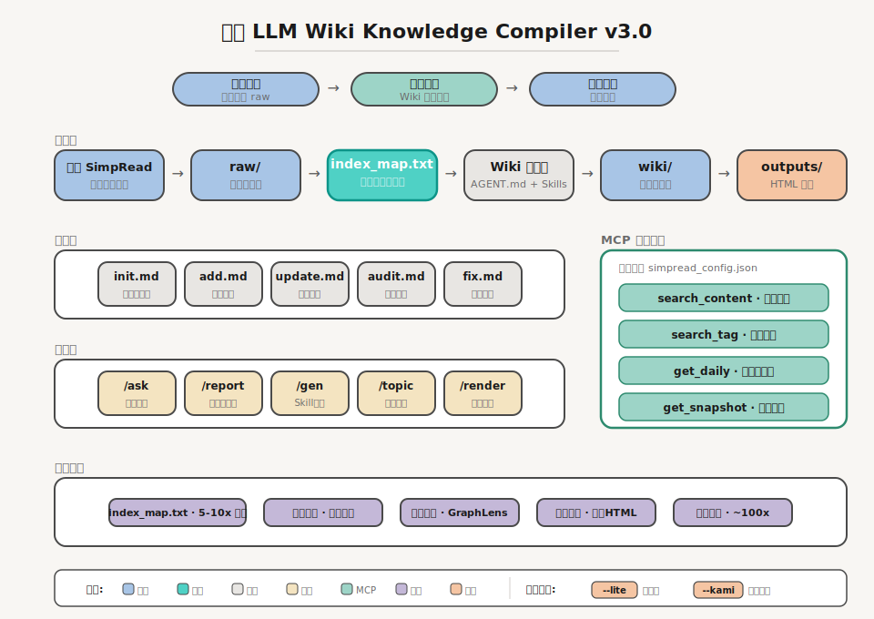

# 🚀 简悦 Andrej Karpathy LLM Wiki 方案 3.0 版

> **从 “稍后读” 到 “终身维基” ：专为重度阅读者打造的个人知识内化方案。**

[](https://opensource.org/licenses/MIT)
[](https://simpread.pro/)
[](https://github.com/Kenshin/simpread-karpathy-llm-wiki-compiler/releases/tag/v3.0.0)
[](CHANGELOG.md)


## 🌟 核心理念

作为 [简悦（SimpRead）](https://simpread.pro) 的创建者，我设计了这个框架，旨在弥合 “稍后阅读（Read-it-Later）” 与 “永远不读（Read-it-Never）” 之间的鸿沟。

本项目是基于 **Andrej Karpathy** 提倡的 **[LLM Wiki](https://gist.github.com/karpathy/442a6bf555914893e9891c11519de94f)** 概念构建的 **个人知识库自动化知识构建方案**。它不仅是一套工具链，更是一种将 “被动囤积” 转化为 “主动内化” 的个人知识库自动化构建协议。

这套框架利用具备文件读写权限的 AI 环境，将任意本地 Markdown 文件（或通过简悦导出的本地的本地快照）转化为高度结构化、可溯源、且具备双向链接的个人维基（Wiki），专为处理 **大规模（1000+）异步阅读素材** 而生。

我使用这套框架管理着通过 **简悦 (SimpRead)** 收集的数千个深度阅读内容（稍后读）。它不只是简单的存储，而是通过一套 **协议驱动型架构**，将凌乱的 HTML/Markdown 剪藏增量编译为具备高度逻辑性、可回溯、且带有本地快照链接的结构化维基。

它比 [RAG 方案](https://github.com/Kenshin/simpread/discussions/categories/%E7%AE%80%E6%82%A6-ai) 更简洁，比[ AI 浏览器方案](https://github.com/Kenshin/simpread/discussions/7283) 更强大，这套框架的 👉 [具体使用方案](https://github.com/Kenshin/simpread-karpathy-llm-wiki-compiler)

## 😆 太长不看

简悦用户请 [移步到这里](#-简悦用户专属配置) 其他用户请直接 [移步到这里](#-使用说明) 或直接查看 [快速上手](#-快速上手)

## 🧬 设计哲学：Karpathy LLM Wiki Protocol

* **原子化 (Atomic)**：知识点被拆解为最小逻辑单元。

* **原始数据驱动 (Data-Driven)**：Wiki 只是 Raw 素材的 “编译产物”，随原始数据的演进而进化。

* **显式溯源 (Grounding)**：每一条知识 `wiki/` 均引用原始来源 `raw/`。

* **无损演进 (Non-destructive)**：采用 `[ADD]` 增量合并与 `[FIX]` 轨迹修正，完整保留知识的迭代过程。

## 👥 目标受众

1.  **理念践行者**：对 Andrej Karpathy LLM Wiki 理念感兴趣，且具有大量处理大量本地文件（知识库）的用户。

2.  **简悦资深玩家**：已配置 [本地知识库](https://www.yuque.com/kenshin/simpread/wkswh7) 的简悦用户。

## ✨ 特点与优势

* **低消耗**：2.0 版增加了索引 `index_map.txt` 每次生成 Wiki 时 Token 消耗降低 **5-10 倍** [详细说明](#-高级用法index_maptxt-生成工具)

* **无须配置**：支持开箱即用。

* **增量更新**：仅处理新增或修改的文件，节省 Token 并提高效率。

* **海量处理**：支持 1000 行以上的大文件以及多主题并发处理。

* **高度扩展**：支持自定义技能库( `skills/` )，轻松实现功能插件化。

* **协议与数据解耦**：不依赖于特定 LLM 的长期记忆（Long-term Memory），而是依赖于本地文件夹中的结构化事实和操作协议。

* **简报模式**：专门用于大量数据提取主题并生成简报，可直接生成 ASCII / Mermaid / 表格 / 关系图等结构。

* **知识图谱可视化 (GraphLens)**：内置可视化浏览器工具，一键将 Wiki 中的 Mermaid 知识图谱渲染为可交互关系网络图，支持节点快照直达、Peek 侧边预览与多图谱切换 [详细介绍](#-graphlens让-wiki-知识-活-起来)

* **排版系统**：内置 `--lite`（零依赖默认）和 `--kami`（需安装 skill）两套排版方案，将 Wiki 条目、简报、搜索结果一键渲染为高质量 HTML 文件。`--lite` 支持暗色模式、纯数字快照链接、8 种 SVG 图表组件 [详细介绍](#-高级用法排版系统) 并配套本地预览工具，一键查看渲染效果 [详细介绍](#%EF%B8%8F-高级用法renderpeek---本地预览)

* **跨环境命令解析**：Wiki 环境（`/report`、`/ask`）与 MCP 环境（搜索）无缝协作，支持 `::mcp:` 前缀和 `~x` 缩写混用修饰符  [详细介绍](/tools/README.md)

## 🔥 相比 RAG 的优势

| 维度 | 传统 RAG (Vector Search) | **Karpathy LLM Wiki (本项目)** |
| :--- | :--- | :--- |
| **处理量级** | 面对数千个长文本时，检索结果容易产生碎片化。 | **全局掌控。** 专为数千个长文设计的 “流式吞噬” 协议，逻辑不留死角。 |
| **溯源精度** | 仅定位到语义片段。 | **原子级回溯。** 每个事实精准挂载 **简悦本地快照链接 (Localhost)**。 |
| **知识深度** | 关键词匹配，难以理解复杂的因果链。 | **深度架构。** 像编译代码一样理清技术演进与产品哲学。 |
| **稳定性** | 容易受到模型幻觉和切片干扰。 | **确定性。** 每一行 Wiki 都有对应的 `Source` 账本支撑。 |

## ⚠️ 处理大文件的机制

为解决大文件导致的 “信息截断” 顽疾，本方案内置了 **强制分块读取流**：

1.  **行数预检**：AI 处理前会先确认原始文件的总行数。

2.  **循环吞噬**：若超出单次处理窗口，AI 会自主执行循环分段读取（如 `read_lines`），直至触达文件末尾（EOF）。

---

## 🏗️ 整体架构



> Mermaid 源文件：[assets/architecture.mmd](assets/architecture.mmd)

## 📂 目录结构说明

```text
.
├── raw/              # 原始素材库：按主题文件夹存放原始素材
│   ├── 主题A/         # 主题文件夹，每个主题文件夹对应一个 Wiki 页面（如果是简悦用户的话，每个文件夹下面有若干个序号从 0 开始的文件 e.g. `0.md`, `1.md`, ...
│   ├── 主题B/
│   ├── 主题C/
├── wiki/             # 目标知识库：编译后的 Wiki 页面 (*.md)
├── tools/            # 工具集
│   ├── indexes/      # index_map.txt 生成工具（详见下方说明）
│   ├── graph/        # GraphLens 知识图谱可视化工具（详见下方说明）
│   ├── render/       # RenderPeek HTML 预览工具（详见下方说明）
│   ├── template/     # 排版模板系统（lite.html + lite-diagrams.md）
│   ├── mcp/          # MCP 服务器
│   └── skills/       # Skill 技能
├── skills/           # 核心技能库
├── assets/           # 项目资源（架构图 SVG + Mermaid 源文件）
├── command/          # 常用命令
└── AGENT.md          # 全局元协议：定义 AI 执行任务时的基本准则
```

---

## 🛠️ 技能库 (Skills) 详解

### 0️⃣ 全量初始化：`skills/init.md`

全量扫描 `raw/` 根目录，在 `wiki/` 创建相应的主题，建立 `INDEX.md` 索引锚点。

### 1️⃣ 添加操作：开辟新主题 `skills/add.md`

识别 raw/ 下的新主题，自动注册（在 `wiki/` 创建对应 `.md` ）至 Wiki 体系。

### 2️⃣ 更新操作：深化已有主题 `skills/update.md`

仅处理新增素材，执行增量追加。

### 3️⃣ 全量审计：`skills/audit.md`

对特定主题重新深度扫描，找回隐藏的逻辑关系，丰富简略段落。

### 4️⃣ Sources 账本修复：`skills/fix.md`

2.0 版新增功能，用于「修复」 1.0 版映射关系的问题，即 `wiki/{主题}.md` 中缺失或不完整的 `## Sources（映射表）` 区块。当历史时期生成的 Wiki 页面缺少来源账本，或与 `raw/{主题}/index_map.txt` 不对齐时启动。

**使用前提：**
- 此功能依赖 `index_map.txt` 存在，此文件由 [同步助手 ≥ 1.5.2](https://github.com/Kenshin/simpread/discussions/3864#discussioncomment-16566521) 自动生成，如果是非简悦用户，也可使用 `tools/indexes/` 下的脚本手动生成，详见 [index_map.txt 生成工具](#-indexmaptxt-生成工具)。

- **单主题修复**：`/gen fix.md {主题}` - 专门修复指定主题的 Sources 映射表
- **批量修复**：`/gen fix.md` - 扫描 `wiki/INDEX.md`，批量修复所有可修复主题

**使用场景：**
- Wiki 页面存在但 Sources 区块缺失
- Sources 区块中的快照链接不完整
- raw 侧新增了 `index_map.txt`，需要对齐 wiki 侧账本

**注意事项：**
- 仅修改 `## Sources（映射表）` 区块，严禁修改正文其他部分
- 若 `index_map.txt` 不存在，自动降级为直接扫描 `raw/{主题}/*.md` 重建账本

### 5️⃣ 知识消费协议：`command/qa.md`

强制执行 “知识库优先” ，当内部知识库无法满足回复时，将会引用外部知识体系。

### 6️⃣ 快捷命令：`command/ask.md`

执行后，自动调用 `command/qa.md` 的回答规则，在之后将使用 `/ask [提问内容]` 提问。

### 7️⃣ 执行 skills 命令：`command/generate.md`

输入 `/gen [快捷指令]` 调用具体的 skills 命令。

### 8️⃣ 输出简报：`command/report.md`

执行 `/report [主题]` 自动生成基于架构图的深度洞察简报。

生成图表时包含了 `ASCII` （默认）和 `Mermaid` 方案，可通过 `/report --mermaid` 或 `/report -- ascii` 切换。

执行 `--output` 在输出简报的同时会同步保存到 `output/` 文件夹内，例如 `/report OpenAI --output`

### 9️⃣ 排版系统：`command/render.md`

将 Wiki 条目、简报、搜索结果渲染为 HTML 文件。内置 `--lite`（零依赖默认）和 `--kami`（需安装 skill）两套方案，可附加在 `/render`、`/report`、`/ask` 或 MCP 搜索命令之后。

📖 **详细介绍**：[高级用法：排版系统](#-高级用法排版系统) ｜ [tools/template/README.md](tools/template/README.md)

### 🔟 执行 skills 命令：`command/refresh.md`

当修改 `AGENT.md` `skills/` `command/` 里面的内容后，需要使用此命令获取并理解这些内容。

执行 `/refresh [文件名]` 仅重新读取指定文件的内容，例如 `/refresh audit.md`

### #️⃣ 执行 skills 命令：`command/startup.md`

当前库已经在使用了，只是迁移到新环境时执行 `startup.md`

---

## 📖 使用说明

### 📥 下载

`git clone git@github.com:Kenshin/simpread-karpathy-llm-wiki-compiler.git` 或 **手动下载并解压缩到任意目录**

### 🚀 首次使用

执行 `startup.md`

### 💡 提问

1.  输入 `/ask [提问内容]` 即可开始提问。

2.  输入 `/report [主题]` 即可开始生成对应主题的简报。

### 🧰 后续维护

1.  **添加新主题**：输入 `/gen add.md`

2.  **更新旧主题**：输入 `/gen update.md`

### 🔎 审查（重新梳理任意主题）

当某个主题的内容较大时（如 1000 行以上，包含多个索引 .md 文件），LLM 生成的 Wiki 的知识颗粒度可能不够，这时需要使用 `audit.md` 进行深度审计。

1.  执行 `generate.md` 内容（仅需一次，如已执行，则无须再次使用）。

2.  输入 `/gen audit.md` 开始针对某一主题进行重新审计。

### 🔄 更新技能

当修改 `AGENT.md` `skills/` `command/` 里面的内容后，需要使用此命令获取并理解这些内容。

1.  执行 `refresh.md` 内容（仅需一次，如已执行，则无须再次使用）。

2.  输入 `/refresh` 全部重新扫描 `skills/` `command/` 的内容并重新理解和严格执行。

2.  输入 `/refresh [filename]` 开始针对某一主题进行重新审计，如 `/refresh audit.md` 仅重新理解和严格执行 audit.md。

---

## 📚 快速上手

为方便快速上手，此框架中内置了一些 Demo 数据（来自通过简悦生成的 276 篇文章，分为 47 个文件），位置在 `raw/标签@科技史话_AI战争/` 下面，同时使用这套访问生成了对应的 `wiki/标签@科技史话_AI战争.md`

1.  [下载](#-下载)

2.  执行 `startup.md`

3.  提问 `/ask 请以 OpenAI 为关键字，生成一份以时间线为主的简报，并按照 /report 的格式给出答案。`

稍等片刻后就会得到非常不错的 Wiki 效果。

## 🌊 工作流指南

* **情况 A（新主题）**：素材放入 `raw/` → 输入 `/gen add.md` → 确认报告并 `开始执行`。

* **情况 B（更新素材）**：新素材丢进 `raw/已有主题/` → 输入 `/gen update.md` → 查看变更日志。

* **情况 C（深度挖掘）**：如果觉得某个 Wiki 主题内容有缺失可输入 `/gen audit.md` 后根据提示重新从 `/raw/[主题]` 挖掘。

* **情况 D（提问）**：输入 `/ask [你的问题]`。

* **情况 E（简报）**：输入 `/report [主题]`。

* **情况 F（排版）**：输入 `/render [主题] --lite` 将 Wiki 条目排版为 HTML 文件（默认 `--lite`，也可用 `--kami`）。

* **情况 G（高级用法）**： 输入 `/ask 请在 AI 相关内容中检索 OpenAI CEO 相关内容，并按照 /report 方案整理。`

* **情况 H（高级用法）**： 输入 `/ask 请在 AI 相关内容中检索 OpenAI CEO 相关内容，并按照 /report -- mermaid 方案整理。`

## 🔥 高级用法：MCP 工具集成

本项目 2.0 版本新增 **MCP (Model Context Protocol) 工具集成**，让你可以直接查询简悦本地快照库，实现实时、精准的内容检索。

> 📖 **完整文档**：[tools/README.md](tools/README.md)

### 💡 核心价值

| 传统方式（Wiki 扫描） | MCP 方式（实时查询） |
|---------------------|-------------------|
| 仅能查询 `raw/` 中的文件 | 直接查询 `simpread_config.json` 中的所有稍后读 |
| 需要预先编译到 Wiki | 实时检索，无需预处理 |
| 适合深度知识整理 | 适合快速内容检索和简报生成 |

### 🎯 使用场景

**场景 1：今日阅读回顾**
```
今日阅读回顾
→ 自动获取今天收藏的所有文章，并生成简报

今日阅读回顾 ~r
→ 以简报形式返回，并将本地快照转换为原文链接（适合手机端）
```

**场景 2：关键词搜索**
```
请查询关键词 OpenAI
→ 搜索所有包含"OpenAI"的文章，以简报形式返回

查询关键词 openai 在此结果检索 马斯克 内容，并生成简报 ~r
→ 先搜索"openai"，再在结果中筛选"马斯克"相关内容
```

**场景 3：标签筛选**
```
获取标签为 AI 的文章，并生成简报
→ 获取所有标记为"AI"的文章，生成结构化简报
```

**场景 4：结合 Wiki 命令**
```
请查询关键词 OpenAI 在此结果中查询与 马斯克 的相关内容，并生成简报 -m ~r
→ MCP 检索 + Wiki 生成 Mermaid 图表 + 原文链接转换
```

**场景 5：排版输出**
```
查询关键词 星巴克 在此结果中找出与新任CEO相关内容 --lite
→ MCP 检索 + lite 排版 → outputs/星巴克-新任CEO.html

查询关键词 星巴克 在此结果中找出与新任CEO相关内容 --kami
→ MCP 检索 + kami 排版 → outputs/星巴克-新任CEO.html

/render 星巴克 --lite
→ Wiki 条目排版为轻量 HTML 文件（outputs/星巴克.html）
```

### 🛠️ 可用工具

| 工具 | 功能 | 示例 |
|------|------|------|
| `get_daily` | 按日期获取内容 | 今日、本周、最近7天 |
| `search_content` | 全文搜索 | 搜索"OpenAI" |
| `search_tag` | 标签筛选 | 获取"AI"标签下的文章 |
| `get_snapshot` | 获取快照正文 | 读取指定 ID 的完整内容 |
| `get_unread_by_idx` | 获取文章元数据 | 获取标题、URL、时间等 |

### 🔗 与 Wiki 方案的协作

```
📚 Wiki 方案：负责深度知识整理，生成结构化的 Wiki 页面
🔎 MCP 工具：负责实时内容检索，生成动态简报

两者结合，实现：
- Wiki 提供深度和结构
- MCP 提供广度和实时性
```

### ⚙️ 安装配置

MCP 工具需要额外配置，详见：
- [安装指南](tools/README.md#-安装配置)
- [Claude Desktop 配置](tools/README.md#-claude-desktop)
- [Claude Code 配置](tools/README.md#-claude-code-cli)
- [Codex 配置](tools/README.md#-codex-cli)

---

## 🔧 高级用法：index_map.txt 生成工具

`index_map.txt` 是 2.0 版本增量感知的核心，用于建立 `raw/` 下 `.md` 文件与简悦本地快照之间的映射关系。

### 📝 生成方式

`index_map.txt` 有两种来源：

| 方式 | 说明 |
|------|------|
| **同步助手自动生成** | 同步助手 ≥ 1.5.2 版本在导出本地快照时自动生成，无需手动操作 |
| **本工具手动生成** | 当 `index_map.txt` 缺失或需要重新生成时，使用 `tools/indexes/` 下的脚本 |

### 🛠️ 多平台脚本

提供 4 种语言实现，可根据运行环境选用，输出完全一致。

| 文件 | 平台 | 依赖 |
|------|------|------|
| `generate.sh` | macOS + Linux | bash, sed, awk |
| `generate.js` | 跨平台 | Node.js |
| `generate.py` | 跨平台 | Python 3.9+ |
| `generate.bat` + `generate.ps1` | Windows | PowerShell 5.1+ |

### 💡 使用方式

```bash
# 扫描 raw/ 下全部目录
bash tools/indexes/generate.sh -a

# 扫描指定目录
node tools/indexes/generate.js -m 霸王茶姬 瑞幸
```

> 📖 **完整文档**：[tools/indexes/README.md](tools/indexes/README.md)

## 🔍 高级用法：GraphLens - 让 Wiki 知识「活」起来


Wiki 是线性的文字，但知识本身是网状的。**GraphLens** 是 3.0.0 版增加的一个可视化浏览器工具，能将 Wiki 中的 Mermaid 知识图谱自动渲染为可交互的关系网络图。

此工具位于 `tools/graph` 目录下。

### 它能做什么？

- **一键查看**：从下拉菜单选择任意 Wiki 文件，自动提取其中的知识图谱并渲染
- **关系洞察**：不同类型的实体（人物、组织、事件）用不同颜色区分，一眼看出知识结构
- **快照直达**：点击任意节点或链接，直接打开对应的简悦本地快照原文
- **Peek 模式**：类似 Notion 的侧边预览，不离开当前页面即可阅读原始来源
- **多图谱支持**：一个 Wiki 文件中包含多个图谱时，可分别查看或合并展示
- **拖拽布局**：左右分栏宽度可自由拖拽调整

### 如何使用？

```bash
# 进入工具目录并启动
cd tools/graph
./start.sh        # macOS / Linux
start.bat         # Windows
```

浏览器打开 `http://localhost:9234`，从下拉菜单选择 Wiki 文件即可。

### 简悦用户

如果你是简悦用户的话，当设置完 [raw 目录](https://github.com/Kenshin/simpread/discussions/3864#discussioncomment-16566521) 后，即可直接在浏览器中打开 [http://localhost:7026/rag/wiki/index/](http://localhost:7026/rag/wiki/index/) 查看。

> 📖 **完整文档**：[tools/indexes/README.md](tools/graph/README.md)

## 🎨 高级用法：排版系统

Wiki 是 Markdown，但分享和阅读时需要更好的视觉呈现。**排版系统**将 Wiki 条目、简报、搜索结果一键渲染为高质量 HTML 文件。

内置两种排版方案：

| 方案 | 标识 | 特点 |
|------|------|------|
| **Lite**（默认） | `--lite` | 零依赖开箱即用，暗色模式，LXGW WenKai 字体，8 种 SVG 图表组件 |
| **Kami** | `--kami` | 需安装 [Kami](https://github.com/tw93/kami) skill，支持 PDF 输出，14 种图表组件 |

`--lite` / `--kami` 是跨环境通用修饰符，可附加在任何产出内容的命令之后：

```
/render 星巴克 --lite          ← Wiki 条目直接排版
/report 星巴克 --lite          ← 生成简报后排版
查询关键词 星巴克 --lite        ← MCP 搜索后排版
```

不指定时默认走 `--lite`。输出至 `outputs/` 目录，纯数字快照链接（如 `4873`）可点击跳转原文。

> 📖 **完整文档**：[tools/template/README.md](tools/template/README.md)

## 👁️ 高级用法：RenderPeek - 本地预览

排版系统输出的 HTML 文件保存在 `outputs/` 目录下。**RenderPeek** 是一个轻量本地预览工具，让你无需手动打开文件即可在浏览器中即时检查排版效果。

此工具位于 `tools/render` 目录下。

```bash
# 进入工具目录并启动
cd tools/render
./start.sh        # macOS / Linux
start.bat         # Windows
```

浏览器打开 `http://localhost:9235`，从下拉菜单选择 HTML 文件即可预览。支持暗色模式、禁用缓存（始终显示最新版本）。

无需安装任何 npm 依赖，Node.js 环境即可运行。

> 📖 **完整文档**：[tools/render/README.md](tools/render/README.md)

---

## 💰 Token 消耗降低 **5-10 倍**

通过引入 `index_map.txt` 映射表机制，实现**增量感知**，大幅减少不必要的文件读取。

| 对比维度 | 1.x 版本 | 2.0 版本 | 提升 |
|---------|---------|---------|------|
| **变更检测** | 读取所有 raw 文件 | 仅读取 index_map.txt（几行） | **~50x** |
| **快照提取** | 扫描全文提取链接 | 映射表直接获取 | **~10x** |
| **增量更新** | 全量对比，耗时长 | 精准定位变化文件 | **~5-10x** |
| **Sources 维护** | 手动或全量重建 | 自动对齐映射表 | **~3x** |

**实际场景示例：**

```
假设：一个主题包含 10 个 raw 文件，每个文件 1000 行

1.x 版本（无 index_map.txt）：
  → 需要读取 10 个文件 = 10,000 行文本
  → Token 消耗：约 50,000 tokens

2.0 版本（有 index_map.txt）：
  → 读取 index_map.txt = 10 行
  → 仅 1 个文件变化，读取 1 个文件 = 1,000 行
  → Token 消耗：约 5,000 tokens

💡 节省比例：约 10 倍！
```

## 📦 如何升级

1. 更新代码到 [最新版本](#-下载)

2. 确保 raw 文件夹包含 `index_map.txt`（[同步助手 ≥ 1.5.2](https://github.com/Kenshin/simpread/discussions/3864#discussioncomment-16566521) 自动生成，或使用 `tools/indexes/` 脚本手动生成；如无，系统会自动降级为原始扫描）

3. 执行 `/refresh` 重新加载协议

4. 执行 `/gen fix.md` 批量修复旧版本缺失的内容。

**新用户：**

直接使用，开箱即用！

## 🖥 仅迁移到新的环境

相比 RAG 方案，此方式可以方便的迁移到任意支持本地操作的 AI 环境中。

假设你已在使用这套 LLM Wiki 了（也就是 `wiki/` 积累了很多内容），当迁移到新环境中，仅需要执行 `startup.md`

✅ Done！

## 📋 命令总览

| 命令 | 入口 | 目标文件 | 职责 | 版本 |
|------|------|----------|------|------|
| `/gen init.md` | `/gen` 路由 | `skills/init.md` | 全量扫描 `raw/` 目录，从零构建所有主题的 Wiki 页面并注册索引 | 1.0 |
| `/gen add.md` | `/gen` 路由 | `skills/add.md` | 识别 `raw/` 下新增的主题文件夹，自动创建对应的 Wiki 页面 | 1.0 |
| `/gen update.md` | `/gen` 路由 | `skills/update.md` | 对已有主题执行增量更新，仅处理新增素材和快照变化 | 1.0 |
| `/gen audit.md` | `/gen` 路由 | `skills/audit.md` | 深度审计指定主题，找回遗漏的因果链、人物背景和本地快照链接 | 1.0 |
| `/gen fix.md` | `/gen` 路由 | `skills/fix.md` | 修复或重建 Wiki 页面的 `## Sources（映射表）` 账本与知识图谱 | 2.0 |
| `/topic` | 独立命令 | `command/topic.md` | 从泛主题中垂直挖掘特定子对象的信息，编译为独立 Wiki 页面 | 1.0.1 |
| `/ask` | 独立命令 | `command/ask.md` | 基于 Wiki 和 Raw 数据的精准溯源问答，每个结论附带本地快照链接 | 1.0 |
| `/report` | 独立命令 | `command/report.md` | 生成可视化深度简报，支持 ASCII / Mermaid 图表，包含架构图+事实表+逻辑拆解 | 1.0 |
| `/render` | 独立命令 | `command/render.md` | 排版系统：将 Wiki 条目、简报、搜索结果渲染为 HTML（`--lite` 默认 / `--kami`） | 3.0 |
| `/refresh` | 独立命令 | `command/refresh.md` | 热重载协议：重新读取 `skills/` 和 `command/` 下的所有文件，强制对齐最新逻辑 | 1.0 |
| `/startup` | 独立命令 | `command/startup.md` | 首次使用或迁移到新环境时执行，加载并确认所有系统协议 | 1.0 |

**路由规则**：`/gen` 是 skill 调度入口，负责将命令分发到 `skills/` 下的具体执行文件；独立命令直接在 `command/` 下定义，各自拥有独立的执行流程。两者职责不同，不合并。

## 🖼 截图

这些截图是在 Trae + MiniMax-M2.7 完成的。

<details><summary>使用 <code>/gen add.md</code> 添加新的主题</summary>
  
</details>

<details><summary>使用 <code>/gen audit.md</code> 审计主题</summary>
  
</details>

<details><summary>使用 <code> /ask 请在 AI 相关内容中检索 OpenAI 相关内容，并按照 /report -- mermaid 方案整理。</code> </summary>
  
</details>

<details><summary>使用 <code>/report 外卖大战商业分析, 以时间线为基准描述。</code> </summary>
  
</details>

<details><summary>使用 <code>/report 东胡的演化，在生成图表时请输入 GraphvizOnline 结构</code> </summary>
  
</details>

<details><summary>使用 <code>/report 时可以按照互动表格提示</code> </summary>
  
</details>

---

## 🔌 简悦用户专属配置

### 🛠️ 深度整合：简悦 (SimpRead) 生态

本项目针对 **简悦 (SimpRead)** 导出的素材进行了专项优化：

- **快照直达**：完美映射简悦本地解析服务器地址 (`http://localhost:7026/...`)，实现从 Wiki 结论到原始阅读环境的秒级跳转。

- **元数据兼容**：自动识别简悦导出的原文地址、标签及原始文件名。

- **海量吞噬**：针对数千个文件可能带来的上下文溢出问题，内置了**动态行数预检**与**分块流式读取**机制。

- **GraphLens 可视化**：通过同步助手设置完 raw 目录后，可直接在浏览器打开 `http://localhost:7026/rag/wiki/index/` 使用 GraphLens 知识图谱可视化工具，点击节点即可跳转简悦本地快照原文 [详细介绍](#-graphlens让-wiki-知识-活-起来)

### 📚 使用前提

1. 用户需配置 [本地知识库](https://www.yuque.com/kenshin/simpread/wkswh7)。

2. 确保同步助手版本 ≥ **1.5.1**，如有必要 [请点击升级](https://simpread.pro/docs/#/Sync?id=下载)。

### 💡 特点

确保存在本地快照即可，设置目录后，可将本地快照以各种检索方式（如标签、时间点、任意搜索内容等）进行保存到 `raw/` 目录。

### ⚡ 在稍后读 · 极速版使用

本项目并不是针对简悦用户，详细说明请 [移步到这里](https://github.com/Kenshin/simpread/discussions/3864#discussioncomment-16566521)。

### 📖 在阅读模式下使用

使用简悦插件 · [导出简悦知识库](https://github.com/Kenshin/simpread/discussions/6714)。

本项目并不是针对简悦用户，详细说明请 [移步到这里](https://github.com/Kenshin/simpread/discussions/6714#discussioncomment-16609930)。

---

## 🤖 使用工具建议

只要是可以操作本地文件的 AI 工具均可，此工程在 [Visual Studio Code](https://code.visualstudio.com/) · [Codex](https://openai.com/codex/) · [Trae](https://www.trae.cn/) · [OpenCode](https://opencode.ai/) 下完成。

分别使用了 `Google Gemini Flash` · `GPT-5.4` · `MiniMax-M2.7` 模型。

---

## 📋 版本历史

查看 [CHANGELOG.md](CHANGELOG.md) 了解从 1.0 到 3.0 的完整更新记录，包括 index_map.txt 增量感知、MCP 工具集成、GraphLens 知识图谱、排版系统等重大功能更新。

## 🤝 贡献与反馈

欢迎提交 Issue 或 Pull Request 来完善编译器协议。

## ⚖️ License

Licensed under the **MIT License**.

---

**SimpRead: Not just for reading, but for building your second brain.**

*Generated by Gemini & SimpRead.*